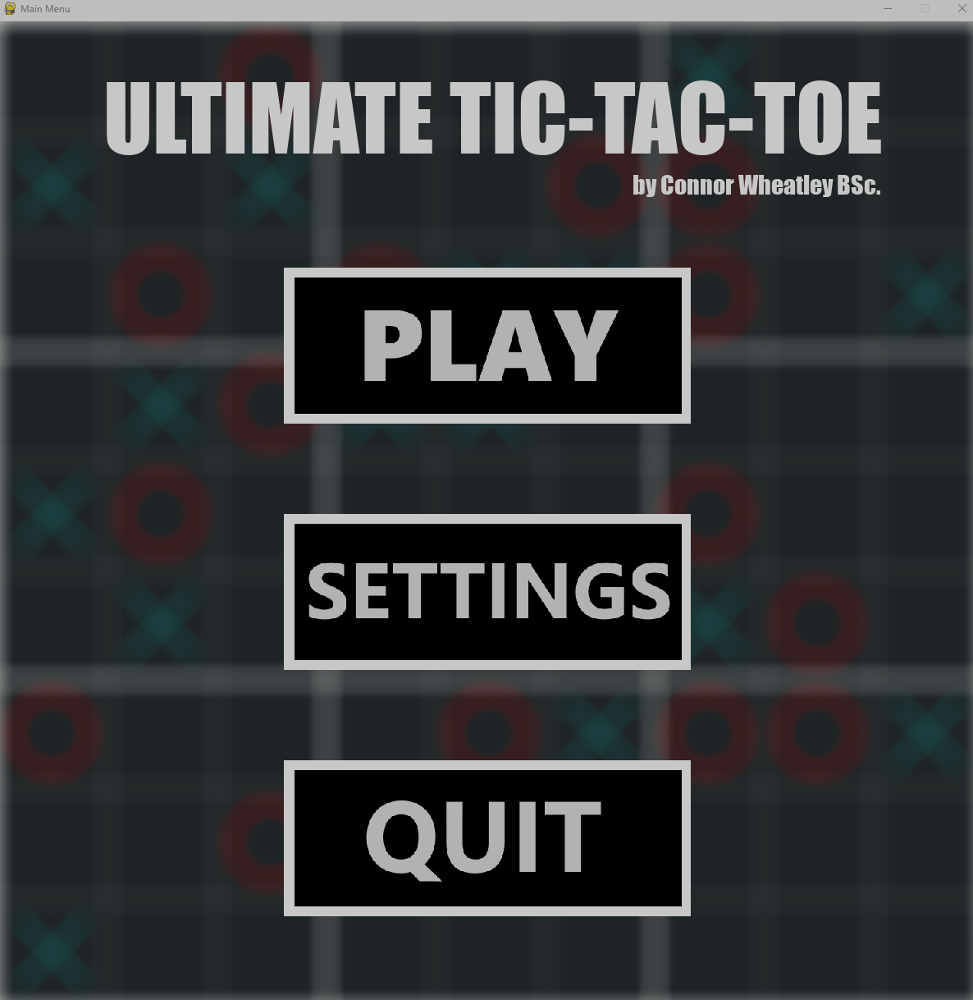

# Utlimate-Tic-Tac-Toe
A python project to create a game of Ultimate Tac Toe as part of a coding challenge at work.

You can either play the game in regular tic-tac-toe mode or in ultimate mode.

# How to run the game
You will need to have python installed as well as Pygame installed to run this.

`pip install pygame`

Then you can run this in the main directory of the game folder:

`python .\ultimate-t3-main.py`

# How to run the unit tests

You will need to have Pytest installed and that can be done by running this:

`pip install pytest`

Once that is done you can type `pytest` into the command line of the main directory to run the unit tests.

# Known Issues/Bugs
- When someone wins a game, if they click on a part of the screen where a button will appear then it will end up clicking the button also. This is due to how mouse clicks are registered in Pygame.
- Sometimes I have noticed that if you click directly on a line on the board it can register to a square not near your click.
- Not all methods have unit tests.